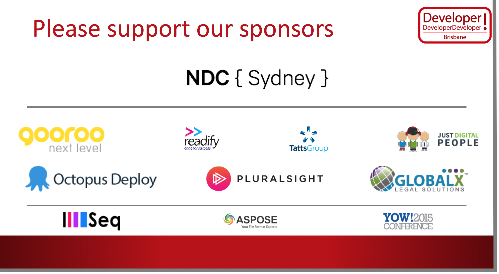
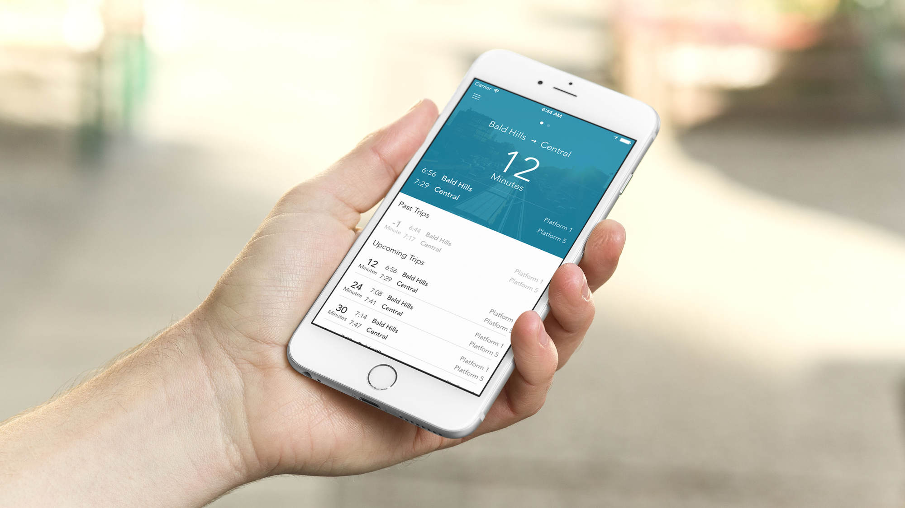
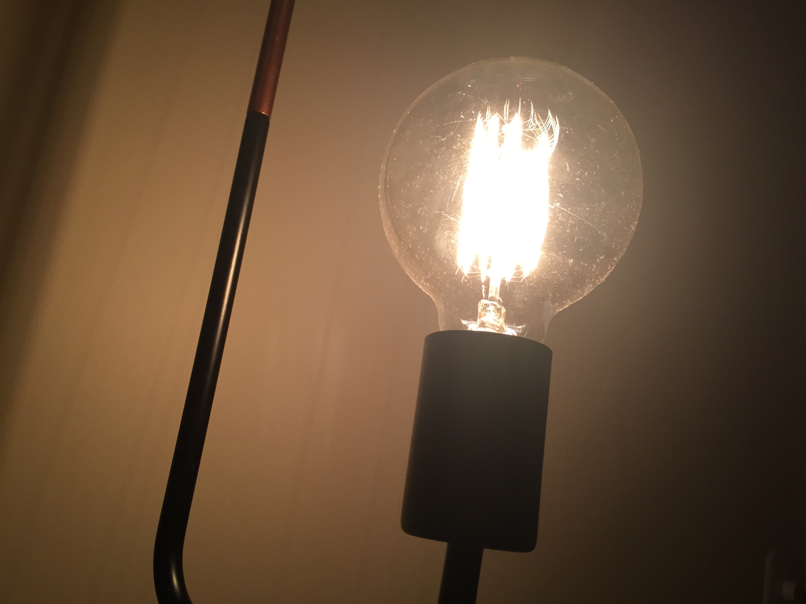
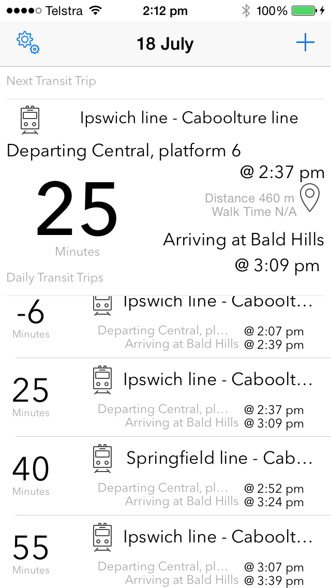
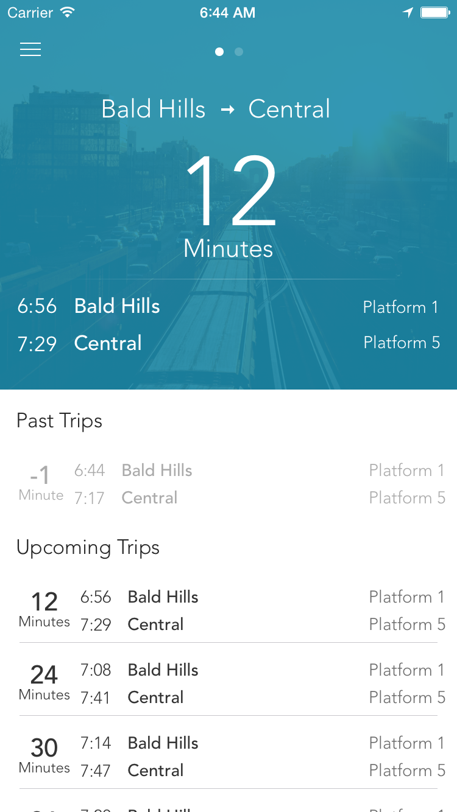
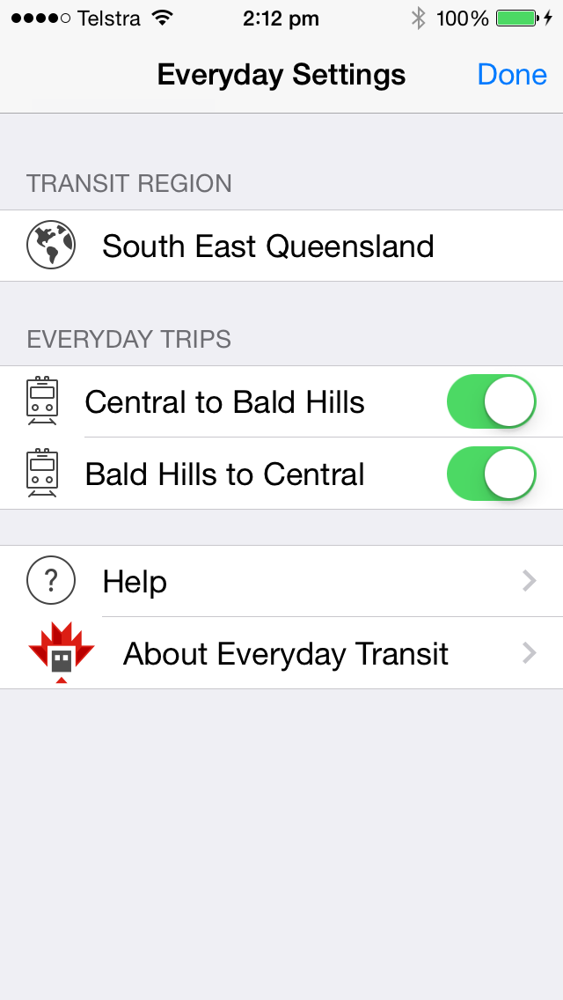
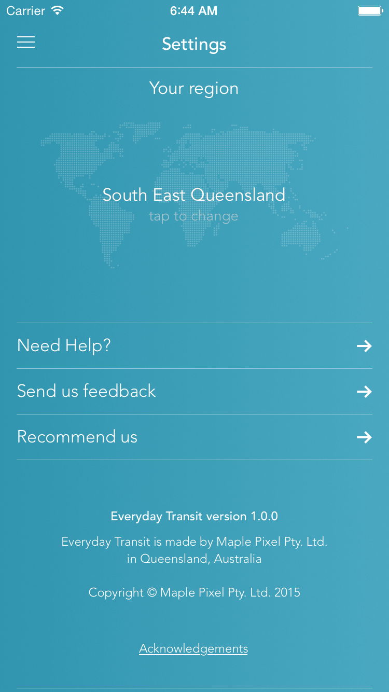
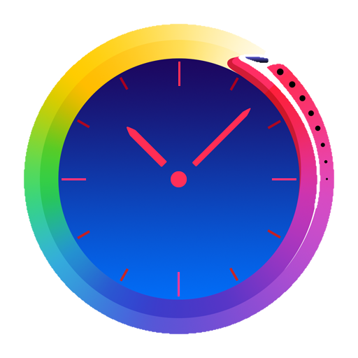
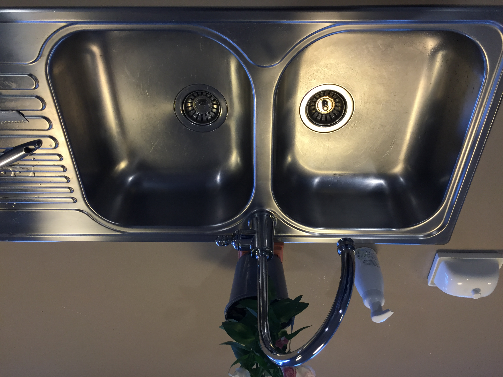
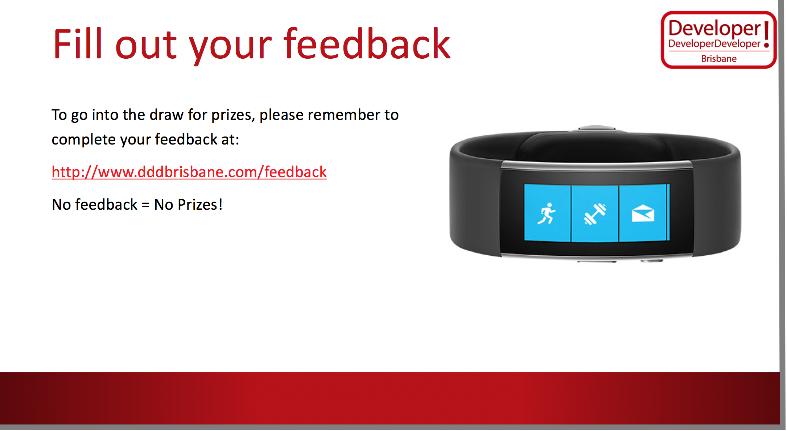

# **Concept**
## to
# **Cash**

#### @robpearson

^ Hello and Welcome
- First, Thanks to my friend Tim Bellette for the awesome photo.  Great shot of Brisbane and the Story Bridge.
- My name is Rob Pearson and I am here to talk about Concept to Cash.
- Actually shipping an app and trying to make money from it!
- Hold questions to the end!

---

^ Thanks to the sponsors
- Without them, this like this aren't possible!

---

# [fit] Do you have an
# [fit] **product idea?**

^ Do you have an idea for a product?
- This presentation will take you on the journey from
- idea to shipping and selling an app based on it.

---

# [fit] **Who** Am I?

^ So who am I?
- I'm a programmer and I've been doing it for around 15 years
- I love building things and working with customers!
- .NET programmer but I also dabble with other languages and platforms.
- Also help organise Brisbane Cocoaheads.  
- Originally from Canada.  Been in Australia for almost 10 years.

---

## [fit] **Octopus**
## [fit] **Deploy**
### by Day

^ I work at Octopus Deploy and I love it but that's not what I'm here to talk about.
- Octopus is hiring.  If you're interested, just search for Octopus on Stack Overflow careers.
- I'm including this slide not only because Octopus is awesome but because this is my day-job.  

---

## [fit] **Maple**
## [fit] **Pixel**
### at Night

^ And I work at Maple Pixel by night.  
- Maple Pixel is my own small business.
- Founded in January 2013.
- Started the company to start building my own products.  
- Grand dreams of striking it rich and getting in on the mobile gold rush.
- I'm bootstrapped and I haven't pursued any investment.
- I'm small and I like it.

---

# Part-Time
# [fit] **Indie**

^ I think of myself as a part-time Independent App Developer.
- Sole director.  Product Designer. Programmer.
- I do all the sales and marketing as well as the customer support.
- Part-time because I have a full time job and a wife and two young sons aged 2 and 4.  
- Time is the critical factor.  

---

# [fit] Everyday **Transit**

#### everydaytransitapp.com

^ In March this year, I shipped an app Everyday Transit for iPhone.  
- It's a transit app for Brisbane.
- Commuter.  Daily commute of >1+ hours
- Same route every day but at different times.  
- Other transit apps frustrating. Tap a million times.
- So I scratched own itch and build my first product.
- I'll used this experience throughout this presentation.

---

# [fit] *Success!*

^ So how's it doing?  
- This is a photo of a boat.  
- A very nice boat.
- It's not my boat.  
- I don't have a boat.

---

# :stuck_out_tongue_winking_eye: Not a
# [fit] **Millionaire**

^ So, I'm not a millionaire.  
- The truth is I've made around $400 and I do think it's successful.  
- ~125 customers
- Goal is 1000 to pay off the investment
- Experience is far greater than the revenue!
- I'd like to work and grow the app.  Buy a boat one day ...

---

# [fit] **Buy** the App!
# [fit] Tell your **friends**

^ That's where you come in ...
- Buy the app and tell your friends!  
- Just joking.  
- Check it out if you'd like.  

---

# [fit] *Agenda*

^ cough
- So, what am I going to talk about?  
- I've boiled down my experience into four key points that I'm going to talk about.

---

## **Build It**
## Polish It
## **Ship it!**
## Sell it

^1. Building it is the easy part and I'll talk about some of things to consider.
2. Polishing it to build something that someone would actually want to buy.
3. Ship it.  Bring everything together to deliver a product to the market.
4. Finally, it's time to try to sell it and support your customers!
- NOTE: Order of Increasing Difficultly!
- NOTE: Not the only way of doing this.  

---

## **Build It**
## Polish It
## Ship it!
## Sell it

^ First, let's build something.

---

# [fit] Side
# [fit] **Projects**

^ How many people have started a side project?
- I have. Learn new things. Build a product.
- Projects went nowhere. Start it.  Develop something and then move on.
- Side projects are the foundation of starting something awesome!
- Programmers love building things so why don't we build products!
- The time has never been better.  Modern app stores.
- Build a digital product, you can sell it once or a million times.

---

# [fit] **Concept**

^ So where do you start.
The concept.
- The best ideas are the ones you're passionate about.
- What interests you?  
- What annoys you?  
- =>Killer idea?  
- If you need an idea, I'd suggest looking at open data sources.  
- I'd recommend staying away from ideas like 'Uber for cats'  
- My story. Frustration about existing apps.  

---

## Start with a
# [fit] **Goal**

^ Before you start anything, you need to set a goal.  
- Part-time. Time is limited.  Very easy to quit.  
- Make it concrete. Write it down.
- Money. Learning. Fun.  Anything.
- Set a goal to help stick with it.  
- Set a time range. Not a deadline.
- My story. Build iOS App (learn something new) and $$$.

---

# Platform and technology

^ I'd like to briefly talk about platform and technology.  
- What was your goal?
- Money.  Go Cross Platform or Apple.
- Learning?  Pick the platform that interests you!
- Native iOS or Android. Or Mac or Windows App.  Web app?  
- My story. Selected iOS to learn something new.

---

# Build a
# [fit] **Prototype**

^ So, you've got an idea and picked a platform.  Great, built it.  
- Build a prototype.  Get it working.  
- Keep it rough!  Explore the idea!
- Essentially, you're trying to validate the idea and the technical bits.
- This is not your Minimum Viable Product.  It's purely a starting point.  
- My Story.  I didn't do this. :(

---

## Build It
## **Polish It**
## Ship it!
## Sell it

^ This leads me to the next big point. Polish it.
- People want things that look good
- Enterprise.  Apps designed by programmers
- Ensure the app is well designed so people will actually buy it.
- Not just the way it looks but the way it flows.

---

# [fit] **Product**
# [fit] Design

^ I'm not a designer.  Comp Sci major.  
- I think of Product design as how a app flows.  Does it make sense.  It is easy.  Is it simple.  
- And They say good design solves a problem.  Does your app solve a problem?  
- Try to keep it simple and try to stay consistent with the platform.
- My Story.
  - App flow.  Tapping multiple screens to find a train time.
  - Solves a problem.  Next train.  
  - Look at other apps. Follow their patterns.  
  - I followed Fantastical.

---

# Hire a
# [fit] **Designer**

^ The best advice I can give is to hire a designer.
- Programmers can't design.
- Hire a designer.  Local is best.
- Dribbble. Behance. Google. Meetups!
- My story.
  - Used prototype for collaboration.
  - Best decision I made.

---

^ I'd like to highlight the value of a designer.  
1. Transit dashboard.
  - He removed a ton of unneeded information.
  - Balanced size and placement.  Effective use of Whitespace.
  - It's clean.  Use of color and weight.  
2. Steve Jobs quote.  Design done.

---

^ Another example.
1. Settings Screen.
  - Again he removed unneeded features.
  - Introduced color. Graphics. Layout.  

---

# App Icon

^ I also had my app icon professionally designed.  
- Differentiator.
- First impression of app.
- Wouldn't do it again neccesariy.
- Cost vs. differentiator.
- Do yourself.  Glyph + a pretty background color.

---

## Build It
## Polish It
## **Ship it!**
## Sell it

^ Finally, it's time to ship.  

---

> Real artists ship!
-- Steve Jobs

^ This is an old saying at Apple, attributed to Steve Jobs, meaning that it is important to actually deliver.
- Concept, prototype, shiny design.  
- This is the critical time between starting something and actually delivering.
- Bring everything together to ship a product!

---

# [fit] **Commitment**

^ Commitment is the biggest part of shipping.
- Side projects.  Limited time.
- Progress is critical for motivation!
1. Constraints.
  - Family
  - Life (Moving House, Baby #2)
2. Strategies
  - Coding on the train
  - Work early/late
  - Lunch Hour

---

# Trade Offs

^ Reality is that you need to cut things to ship.  
- Scope.  What is your goal?
- Perfect Code
- Supportable Code
- Unit Tests
- Test it heavily on the device.  
- Family and friends.  Community. Real World Use.

---

# **Kitchen** Sink

^ By Kitchen Sink, I mean everything else that is required to ship an app to an app store.  
- Accessibility
- Website and support email
- Privacy policy
- Analytics
- Acknowledgements

---

# Submit. Fix. :leftwards_arrow_with_hook:

^ Submitting to Apple can take several goes.  
- Similar to washing your hair.  Wash, rinse, repeat.  
1. Apple.  Submit, fix, repeat until sucessful!
  - Protip: Use Testflight.
  - Protip: http://appreviewtimes.com
2. Google. Faster. Easier.
3. Anecdote. Approval - Happy, Proud.

---

## Build It
## Polish It
## Ship it!
## **Sell it**

^ So, you've shipped your app.  Now what.  

---

# [fit] **Sales**
# and Marketing

^ I think of marketing as trying to get attention for a product.  Get people aware of it.
1. Hard. Not easy. Experiment.
2. Sales Funnel.
  - Potential Customers at top.
  - Cash is at the bottom.
  - Paid up front is where the funnel narrows.

---

# Attention

^ Traction eBook.  
- Advertising.  Traditional vs. Facebook.
- Pitch News Papers
- Contests
- Free stuff (water bottles)
- Flyers
- Email Marketing
- Content Marketing

---

# [fit] **Customer**
# Support

^ What to do when if things break
1. Optimise to avoid support.  $2.50 per sale lost if custom needs support.
2. Support Funnel.
  - Simple Design/Built-in Help
  - FAQ
  - Direct Email (last resort)
3. Give world class support.
   - Thank customer for getting in touch.
   - Try your best to help.
4. Consistent Message. Help grump customers and then then they're your biggest supporter.

---

# [fit] *Summary*

^ So, that's it.  That's concept to cash - actually shipping an app and trying to make money from it.

---

## **Build It**
## Polish It
## **Ship it!**
## Sell it!

^ Just to recap!
- Start with an idea and build a prototype.
- Hire a designer and polish your concept and product.
- Commit to shipping and bring it all together.
- Finally, try to get word out.  Provide friendly support and keep working on updates.  
- If I can do it, so can you!

---

---

# [fit] **Thanks**
###  @robpearson
### maplepixel.com.au

^ Thank you very much.  
- Remember to buy my app and tell your friends! ;)
- Any Question.
